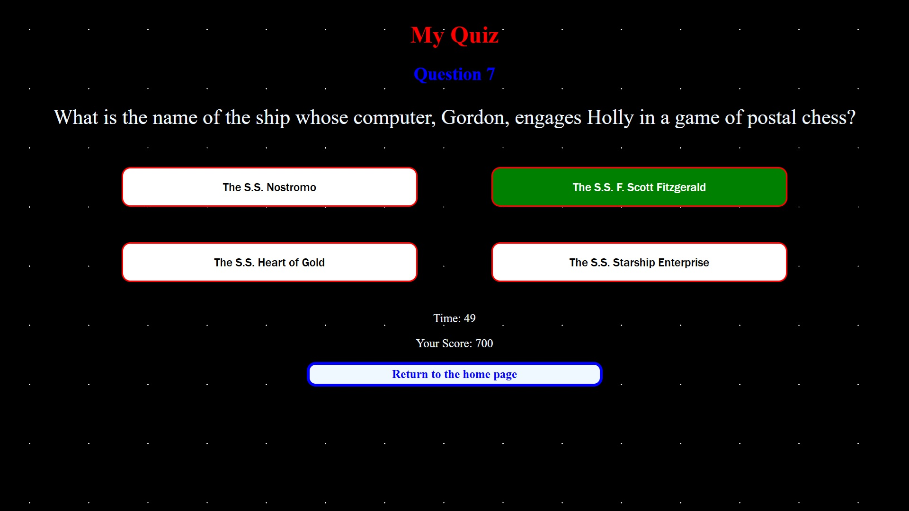
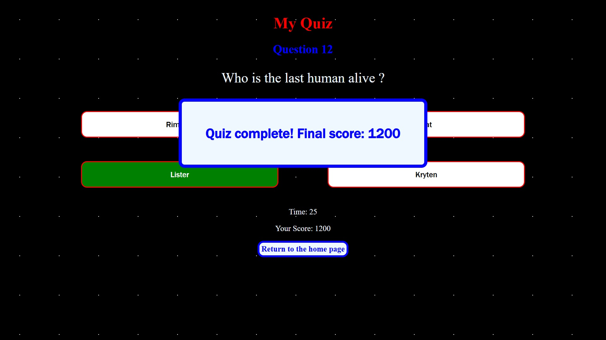

# 📺 Red Dwarf Quiz Game 🚀

Welcome to the **Red Dwarf Quiz Game** – a fun and interactive web-based quiz app that tests your knowledge about the cult sci-fi sitcom *Red Dwarf*! 👾

## 🎮 Features

- 🔢 Multiple Red Dwarf-themed questions
- ⏱️ 90-second countdown timer
- ✅ Immediate answer feedback (correct/incorrect)
- 📊 Score tracking and local high score board
- 💾 Persistent data using `localStorage`
- 📱 Fully responsive design for mobile and desktop
- ✉️ Message alerts for user guidance

## 🛠️ Tech Stack

- HTML5 🧱
- CSS3 🎨
- JavaScript (Vanilla) ⚡
- LocalStorage 📦

## 📌 Note

- All data is stored locally in your browser using `localStorage`.
- Scores reset if local storage is cleared.

---

## 🤘 Built With Love by a Red Dwarf Fan 💖

> "Smoke me a kipper, I'll be back for breakfast!" – Ace Rimmer 🪖

## 📸 Screenshots

Here are a few previews of the Red Dwarf Quiz Game in action:

### 🧩 Quiz Start Screen

### ❓ Question Interface

